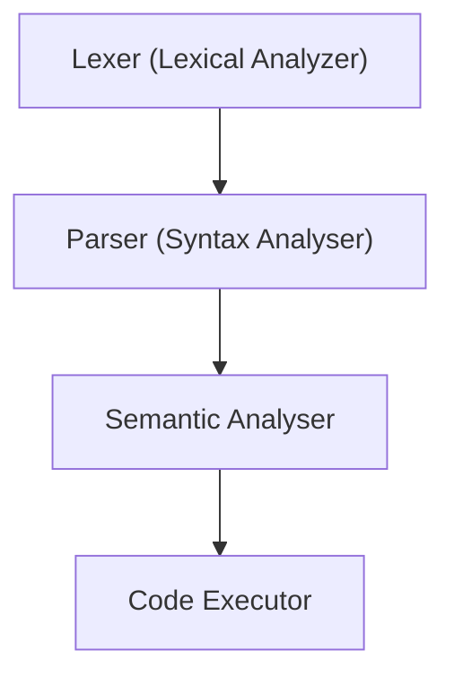

# Design

# To start with

What will be easy to implement:
1. Code execution - executes the same code it runs on

What will be a problem:
1. Imports
   1. runtime imports in go?
   2. maybe skip imports and bind functions strait away
2. 3d party libs usage
3. Async?
4. GC
