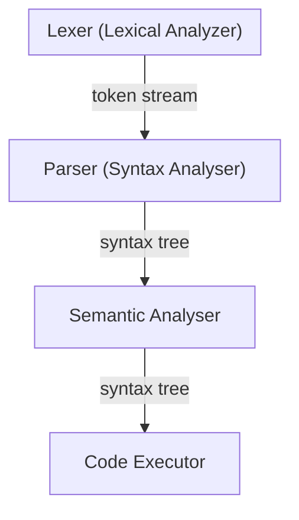

# Design

```mermaid
flowchart TD
    subgraph lexer["Lexer (Lexical Analyzer)"]
    end
    parser["Parser (Syntax Analyser)"]
    semanter["Semantic Analyser"]
    executor["Code Executor"]
    
    lexer-->|token stream|parser-->|syntax tree|semanter-->|syntax tree|executor
```

## Lexer

Lexer does lexical analysis which is a conversion of input stream into meaningfull
lexical tokens with defined type.

This process is done with two steps: Scanning and Evaluation.

### Scanner

This is usually a finite-state machine that captures stream characters into lexemes
(pre-typed strings). As a note: string literal is a lexeme, so no "quote, text, quote"
as separate lexemes in the output.

### Evaluator

TBD

# To start with

What will be easy to implement:
1. Code execution - executes the same code it runs on

What will be a problem:
1. Imports
   1. runtime imports in go?
   2. maybe skip imports and bind functions strait away
2. 3d party libs usage
3. Async?
4. GC
